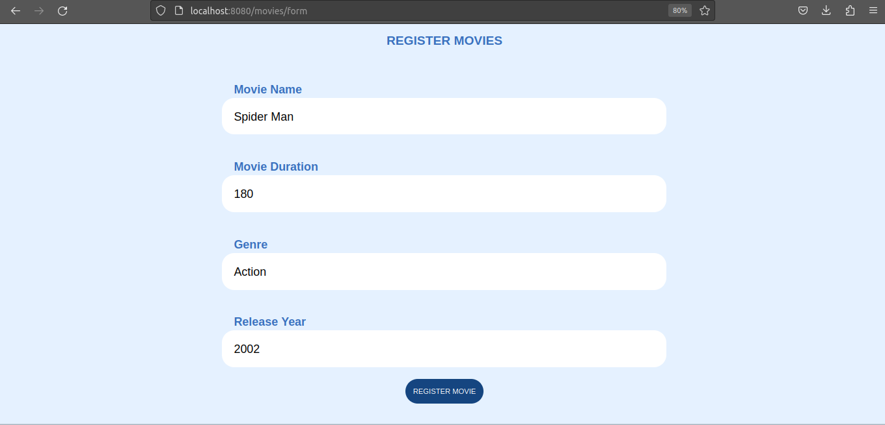
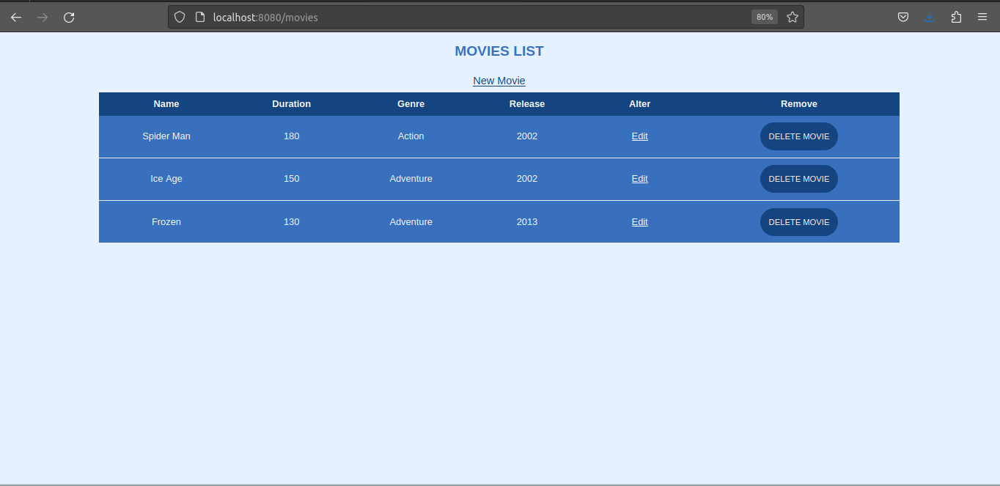

# ScreenMatch

ScreenMatch is a Java Web Project throw Spring framawork.

The project register movies in mysql database. I use the MVC (Model View Control) model. Some modules like Thymeleaf and Spring Web are important to say about. The pom.xml is configured.

#### Technologies

* Java (openJDK 19.0.2)
* Spring Boot 3.1.1
* Maven 4.0.0 
* JPA
* MySQL (8.0.33-0ubuntu0.22.04.2)
* Apache Tomcat 10.1.10
* Sping Servlet
* HTML - CSS

***

#### Dependencies

* DevTools
* MySQL Conector
* Spring Web
* Thymeleaf
* Data JPA

